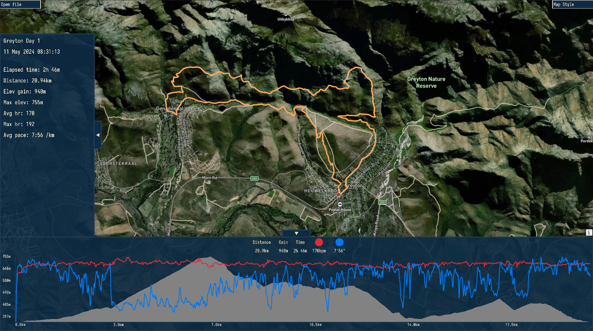

<!-- LOGO -->
<h1>
<p align="center">
  
  <br>Jpx
</h1>
  <p align="center">
    A raster slippy map renderer for viewing gps tracks 
    <br>made using raylib and libcurl
  </p>
</p>




## Usage
```
jpx [OPTIONS] [FILE]

file formats: gpx

OPTIONS:
    -s          map style (0 - 3)
    -k          api key for provided map style
    --help      show this help
    --offline   only use local cached tiles
```
| Style | Name             | Access Requirement                          |
|-------|------------------|---------------------------------------------|
| 0     | OSM              | Free                                        |
| 1     | Jawg terrain     | Needs key [Jawg](https://www.jawg.io/en/)   |
| 2     | Mapbox outdoors  | Needs key [Mapbox](https://www.mapbox.com/) |
| 3     | Mapbox satelite  | Needs key [Mapbox](https://www.mapbox.com/) |

> [!Note]
> Tiles are cached on disk in the .cache directory

## Controls 
| Action | Control         |
|-------|------------------|
| maximize     | f         |
| reset camera | r         |
| open file    | o         |

drag and drop is also supported

## Config
the config file is **jpx.ini** in the same directory as the executable

You can add keys to the config file to always have access to those map styles
```
[Keys]
Jawg=YOUR_KEY
Mapbox=YOUR_KEY
```
## Build
odin version dev-2026-07
```
odin build src/main_desktop -o:speed
```
Use `build.sh` on posix systems.

Use `build_web.sh` for web build.

## References
https://wiki.openstreetmap.org/wiki/Slippy_map_tilenames 

https://en.wikipedia.org/wiki/Web_Mercator_projection
